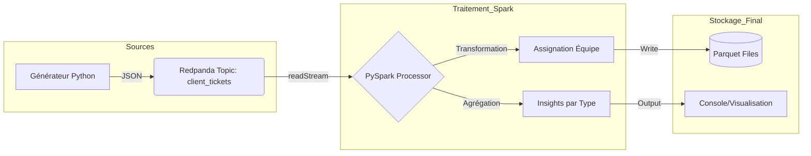

# Indu-tech-poc

## Présentation
Ce projet est un Proof of Concept (POC) simulant une ingestion de données IoT/Tickets en temps réel utilisant **Redpanda** pour le streaming et **PySpark** pour le traitement ETL.

Les tickets sont générés en temps réel et contiennent des informations sur les demandes des clients:

* L'ID du ticket
* L'ID du client 
* La date et l'heure de création
* La demande
* Le type de demande
* La priorité 

Mise en place un pipeline de données pour ingérer, traiter et analyser ces tickets en temps réel. 

## Outils

* Redpanda
* Pyspark
* Docker

## Architecture du Pipeline

